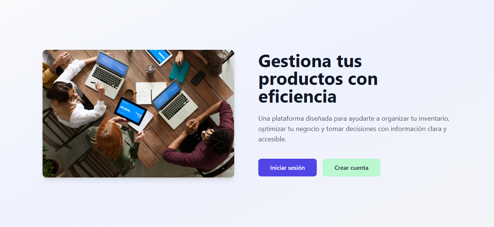
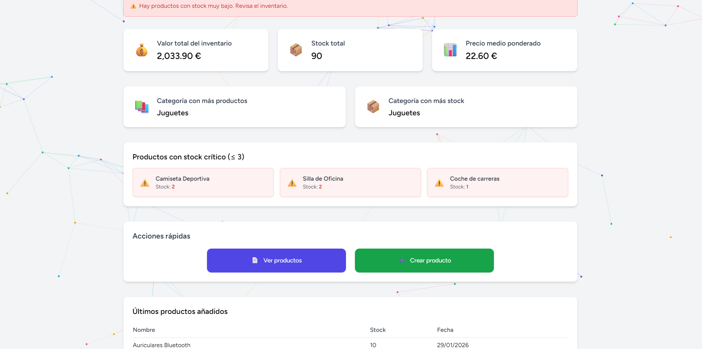
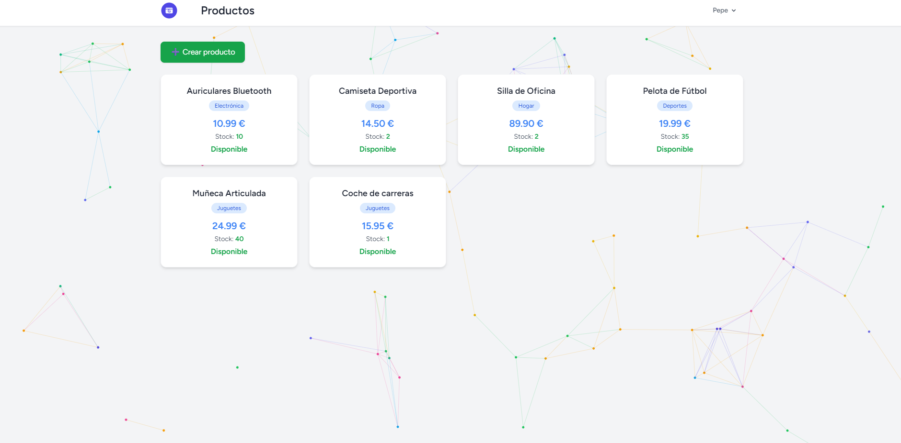
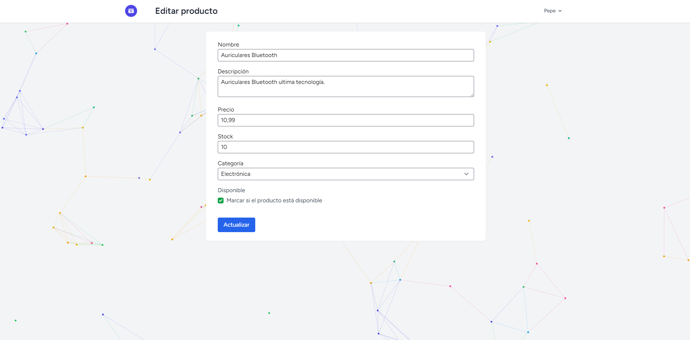
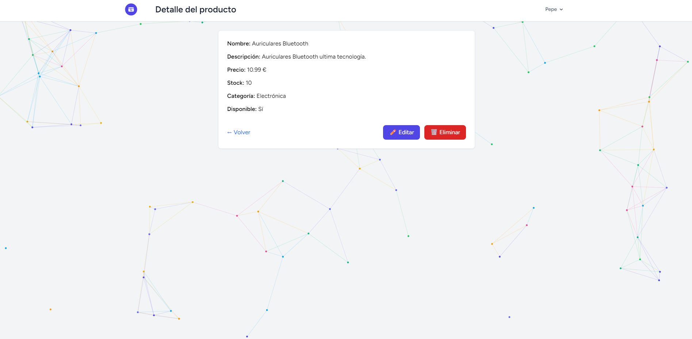

<div align="center">

# 📦 Gestor de Productos

### Sistema de gestión de inventario moderno y eficiente construido con Laravel

[](https://laravel.com)
[](https://php.net)
[](https://tailwindcss.com)
[](https://mysql.com)
[](LICENSE)

</div>

## 📋 Tabla de Contenidos

- [Características](#-características)
- [Tecnologías](#-tecnologías)
- [Estructura del Proyecto](#-estructura-del-proyecto)
- [Instalación](#-instalación)
- [Uso](#-uso)
- [Modelos de Datos](#-modelos-de-datos)
- [Vistas de la Aplicación](#-vistas-de-la-aplicación)
- [Funcionalidades](#-funcionalidades)
- [Capturas de Pantalla](#-capturas-de-pantalla)
- [Contribución](#-contribución)
- [Licencia](#-licencia)

---

## 📋 Descripción

**Gestor de Productos** es una aplicación web CRUD completa diseñada para administrar inventarios de productos de manera eficiente y profesional. Construida con **Laravel 12** y estilizada con **Tailwind CSS**, ofrece una interfaz moderna, responsive y fácil de usar.

### ✨ Características

- 📊 **Panel de Control Estadístico** - Dashboard con métricas en tiempo real
- ✅ **Validación Avanzada** - Formularios con validación tanto del cliente como del servidor
- 🔐 **Sistema de Autenticación** - Laravel Breeze integrado para autenticación segura
- 📦 **Gestión de Stock** - Control de inventario con alertas de stock bajo
- 🏷️ **Categorización** - Organiza productos por categorías
- 🎨 **Diseño Moderno** - UI/UX responsive con Tailwind CSS
- 🔍 **Visualización de Detalles** - Vista detallada de cada producto
- ⚡ **Arquitectura MVC** - Código limpio y bien organizado

---

## 🛠️ Tecnologías

<table>
<tr>
<td valign="top" width="50%">

### Backend
- **Framework**: Laravel 12.0
- **Lenguaje**: PHP 8.2+
- **ORM**: Eloquent
- **Autenticación**: Laravel Breeze
- **Testing**: Pest PHP
- **Desarrollo**: Laravel Pint, Blueprint

</td>
<td valign="top" width="50%">

### Frontend
- **CSS Framework**: Tailwind CSS 3.x
- **Forms**: @tailwindcss/forms
- **JS Framework**: Alpine.js 3.15+
- **Build Tool**: Vite 7.x
- **HTTP Client**: Axios

</td>
</tr>
</table>

---

## 📦 Requisitos

Antes de comenzar, asegúrate de tener instalado:

| Requisito | Versión Mínima | Propósito |
|-----------|----------------|-----------|
| **PHP** | 8.2 o superior | Runtime del servidor |
| **Composer** | 2.x | Gestor de dependencias PHP |
| **Node.js** | 18.x o superior | Compilación de assets |
| **NPM** | 9.x o superior | Gestor de paquetes Node |
| **MySQL** / **MariaDB** | 5.7+ / 10.3+ | Base de datos |
| **Git** | Última versión | Control de versiones *(opcional)* |

---

## 🚀 Instalación

### 1️⃣ Clonar el Repositorio

```bash
git clone https://github.com/fgonmar445/gestorProductos.git
cd gestorProductos
```

### 2️⃣ Instalar Dependencias

#### Backend (PHP/Composer)
```bash
composer install
```

#### Frontend (Node/NPM)
```bash
npm install
```

### 3️⃣ Configuración del Entorno

#### Copiar el archivo de configuración
```bash
cp .env.example .env
```

#### Generar la clave de aplicación
```bash
php artisan key:generate
```

### 4️⃣ Configuración de Base de Datos

Edita el archivo `.env` con tus credenciales de base de datos:

```env
DB_CONNECTION=mysql
DB_HOST=127.0.0.1
DB_PORT=3306
DB_DATABASE=gestor_productos
DB_USERNAME=tu_usuario
DB_PASSWORD=tu_contraseña
```

### 5️⃣ Ejecutar Migraciones

```bash
php artisan migrate
```

> **💡 Tip**: Si deseas poblar la base de datos con datos de prueba, también puedes ejecutar:
> ```bash
> php artisan db:seed
> ```

### 6️⃣ Configuración Opcional (Importar SQL)

Alternativamente, puedes importar el archivo SQL incluido:

```bash
mysql -u tu_usuario -p gestor_productos < gestor-productos.sql
```

---

## 🎯 Uso

### Iniciar el Servidor de Desarrollo

#### Opción 1: Modo Simple
```bash
# Terminal 1: Servidor Laravel
php artisan serve

# Terminal 2: Compilación de Assets
npm run dev
```

#### Opción 2: Modo Concurrente (Recomendado)
```bash
composer dev
```

Este comando ejecuta simultáneamente:
- ✅ Servidor Laravel (`php artisan serve`)
- ✅ Cola de trabajos (`php artisan queue:listen`)
- ✅ Logs en tiempo real (`php artisan pail`)
- ✅ Compilación de Vite (`npm run dev`)

### Acceder a la Aplicación

Abre tu navegador y visita:

```
http://127.0.0.1:8000
```

### Comandos Útiles

```bash
# Ejecutar tests
composer test

# Compilar assets para producción
npm run build

# Limpiar caché
php artisan optimize:clear
```

---

## 📁 Estructura del Proyecto

```
gestorProductos/
│
├── app/
│   ├── Http/
│   │   └── Controllers/
│   │       ├── ProductoController.php    # Controlador CRUD principal
│   │       └── ProfileController.php     # Gestión de perfiles
│   └── Models/
│       └── Producto.php                  # Modelo de producto
│
├── database/
│   ├── migrations/                       # Migraciones de BD
│   └── gestor-productos.sql              # Backup SQL
│
├── resources/
│   └── views/
│       ├── productos/                    # Vistas CRUD
│       │   ├── index.blade.php           # Listado de productos
│       │   ├── create.blade.php          # Formulario de creación
│       │   ├── edit.blade.php            # Formulario de edición
│       │   └── form.blade.php            # Componente de formulario
│       ├── dashboard.blade.php           # Panel de control
│       └── index.blade.php               # Página de inicio
│
├── routes/
│   ├── web.php                           # Rutas web
│   └── auth.php                          # Rutas de autenticación
│
├── public/
│   └── images/                           # Capturas de pantalla
│
├── composer.json                         # Dependencias PHP
├── package.json                          # Dependencias Node
├── tailwind.config.js                    # Configuración Tailwind
├── vite.config.js                        # Configuración Vite
└── README.md
```

---

## 🎨 Modelo de Datos

### Tabla: `productos`

| Campo | Tipo | Descripción |
|-------|------|-------------|
| `id` | Primary Key | Identificador único |
| `nombre` | String | Nombre del producto |
| `descripcion` | Text | Descripción detallada |
| `precio` | Decimal(10,2) | Precio del producto |
| `stock` | Integer | Cantidad disponible |
| `categoria` | String | Categoría del producto |
| `disponible` | Boolean | Disponibilidad (activo/inactivo) |
| `created_at` | Timestamp | Fecha de creación |
| `updated_at` | Timestamp | Última actualización |

### Modelo Eloquent

```php
// app/Models/Producto.php
protected $fillable = [
    'nombre',
    'descripcion',
    'precio',
    'stock',
    'categoria',
    'disponible',
];
```

---

## 🧩 Funcionalidades CRUD

### ProductoController

| Método | Ruta | Descripción |
|--------|------|-------------|
| `index()` | `GET /productos` | Lista todos los productos |
| `create()` | `GET /productos/create` | Muestra formulario de creación |
| `store()` | `POST /productos` | Guarda nuevo producto |
| `show()` | `GET /productos/{id}` | Muestra detalles del producto |
| `edit()` | `GET /productos/{id}/edit` | Muestra formulario de edición |
| `update()` | `PUT/PATCH /productos/{id}` | Actualiza producto existente |
| `destroy()` | `DELETE /productos/{id}` | Elimina producto |

> **🔐 Nota de Seguridad**: Todas las rutas de productos están protegidas por el middleware `auth`

---

## 📸 Capturas de Pantalla

### 🏠 Página Principal

*Vista de bienvenida con diseño moderno y atractivo*

---

### 📊 Dashboard / Panel de Control

*Dashboard con estadísticas y métricas del inventario*

---

### 📋 Listado de Productos

*Vista completa del inventario con opciones de filtrado*

---

### ✏️ Editar Producto

*Formulario de edición con validación en tiempo real*

---

### 🔍 Detalles del Producto

*Vista detallada con toda la información del producto*

---

## 🔮 Mejoras Futuras

### En Desarrollo
- [ ] 📷 **Subida de imágenes** - Gestión de imágenes para productos
- [ ] 📊 **Exportación de datos** - Exportar inventario a PDF/Excel
- [ ] 📈 **Gráficos interactivos** - Integración con Chart.js para visualización de datos

### Planificadas
- [ ] 🔍 **Filtros avanzados** - Sistema de búsqueda y filtrado mejorado
- [ ] 👥 **Sistema de roles** - Autenticación por roles (admin/usuario/vendedor)
- [ ] 🌐 **API RESTful** - Endpoint API para integración con otros sistemas
- [ ] 📱 **PWA** - Convertir a Progressive Web App
- [ ] 🔔 **Notificaciones** - Alertas automáticas de stock bajo
- [ ] 📦 **Gestión de proveedores** - Módulo de proveedores y pedidos
- [ ] 💰 **Historial de precios** - Tracking de cambios de precio

---

## 🤝 Contribución

¿Tienes ideas para mejorar este proyecto? ¡Las contribuciones son bienvenidas!

1. Haz un fork del proyecto
2. Crea una rama para tu característica (`git checkout -b feature/AmazingFeature`)
3. Commit tus cambios (`git commit -m 'Add: nueva característica increíble'`)
4. Push a la rama (`git push origin feature/AmazingFeature`)
5. Abre un Pull Request

---

## 📄 Licencia

Este proyecto está bajo la licencia **MIT**. Consulta el archivo [LICENSE](LICENSE) para más detalles.

---

## 👨‍💻 Autor

**fgonmar445**

- GitHub: [@fgonmar445](https://github.com/fgonmar445)
- Proyecto: [gestorProductos](https://github.com/fgonmar445/gestorProductos)

---

<div align="center">

### ⭐ Si este proyecto te fue útil, considera darle una estrella

**Hecho con ❤️ usando Laravel y Tailwind CSS**

</div>